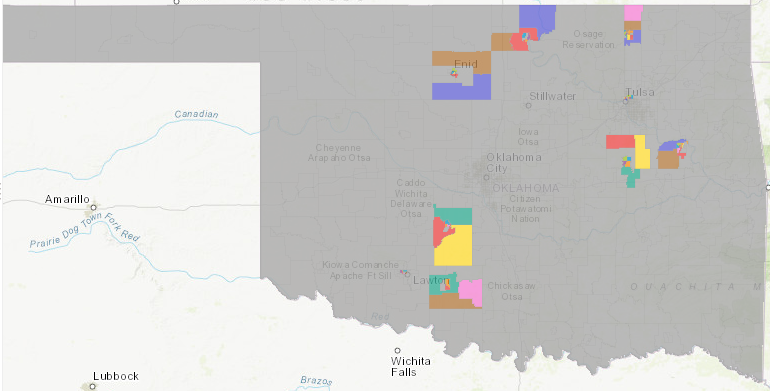

## Carls GEO Portfolio

---

### Earthquake Map of North-Central Oklahoma 

[Earthquakes in OK](/pdf/CWJ_Midterm_GIS5013_Fall2020_202010251645.pdf)

---

### The Effect of Hurricane Patterns on Urban Development on the Gulf Coast of Mississippi

[The effect of hurricane patterns on urban development](/pdf/CWJ_GIS5013_TermPaper_Fall2020.pdf)

---

### Oklahoma Map for GIS5253 Lesson 1

---

Page template forked from <a href="https://github.com/evanca/quick-portfolio">evanca</a>

<!-- Remove above link if you don't want to attibute -->
